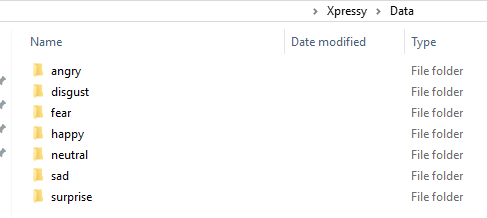

# Xpressy

## Human Emotion Recognition

Emotions play a very important role in our relations with other people and also in the way we make use of computers. Effective computing is a domain that focuses on user emotions while he or she interacts with computers and applications. As emotional state of a person may affect concentration, task solving and decision-making skills, the vision of affective computing is to make systems able to recognize human emotions and influence them in order to enhance productivity and effectiveness of working with computers. Facial Expression Recognition facilitates our capacity for resilience, motivation, empathy, reasoning, stress management, communication, and our ability to read.

## Goal

The goal of this project is to explore the field of Facial Expression Recognition (FER) using existing public datasets and create an application that can be used by various user groups to improve their emotional intelligence skills. The app can be used by police officers, social workers, psychologists and other professionals whose job involves a lot of interactions with people.

## Description of problem

While most people can probably identify happy faces, the task becomes more difficult when they need to differentiate between less popular emotions such as fear, disgust or contempt. It becomes even more difficult if the decision must be made fast.

Multiple researchers including Timothy Turner (Identifying Emotional Intelligence Competencies Differentiating FBI, 2007) argue that emotional intelligence changes with age and can be improved upon. Although, understanding of other people emotions is only a small part of emotional intelligence, it is a critical skill for many occupations. Unfortunately, the emotional intelligence assessments and training programs are still not readily available for many of these professionals.

# Instructions for running project

After you have cloned the repo, [Download the data](https://grail.cs.washington.edu/projects/deepexpr/ferg-db.html) or use your own dataset. If you use your own data set please note that for a Convolution Neural Network it is recommended to have at minimum 1,000 images per class, though this convention has also been challenged recently. [Additional Information](http://benanne.github.io/2015/03/17/plankton.html)

###  About this data

Facial Expression Research Group Database (FERG-DB) is a database of stylized characters with annotated facial expressions. The database contains 55,767 annotated face images of six stylized characters.

## Create the below folders

The python script will read the below folder structure, so your data must be structured like below.

## Install requirements

Run the below in CMD or Git Bash to ensure you have all dependencies installed.

## Run python script

Run CNN.py or CNN.ipynb on your local machine. Please note that depending on your machine you may run out of memory. This took 4 hours to run in Visual Studio Code, but your experience will vary depending on your machine.

## Test saved Model

Use Prediction_test.ipynb to test the model on your own pictures or pictures from the internet.
